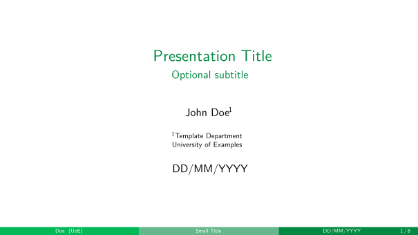

This repository contains a template for beamer presentations using the custom 
`unbBeamer.sty` style that aims to personalize the colors according to the 
University of Brasilia's color palette.

In the `presentation.tex` file there are also some useful commands that I usually
use for presentations. I intend to add more examples later.
